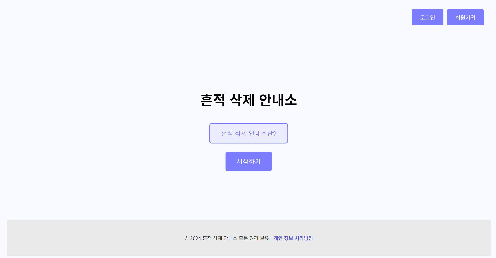
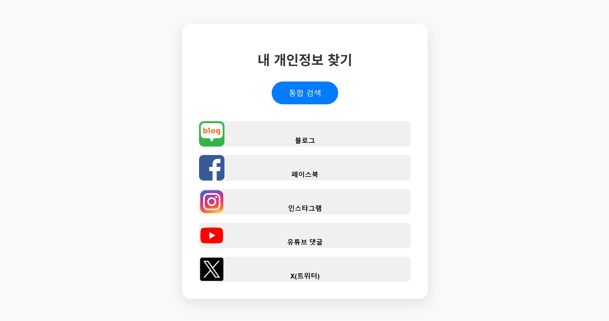
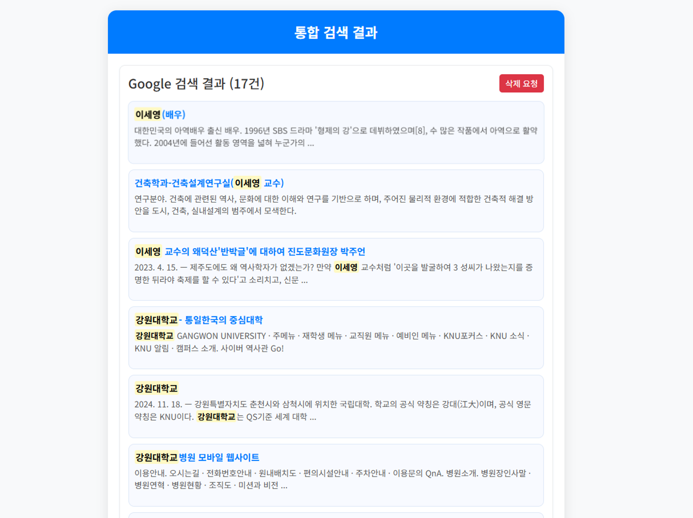
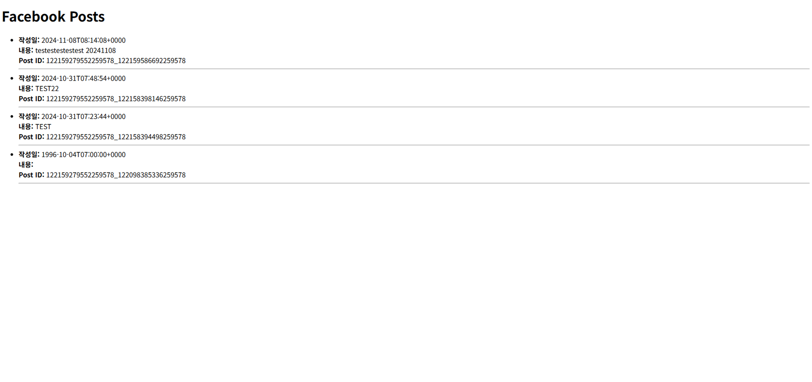

# 흔적 삭제 안내소
'Erasure-Guidance-Center'

흔적 삭제 안내소는 사용자가 인터넷에 퍼져 있는 자신의 개인정보를 검색하고, 삭제 요청을 할 수 있도록 개발 된 프로그램입니다.  
"Erasure-Guidance-Center" is a program designed to help users search for their personal information scattered across the internet and submit deletion requests.

**주요 기능**: Key Features
- 로그인 / 회원가입 기능  
  Login/Sign-up  
- 서비스 기능 (로그인 필요)  
  Service Features (Login Required)  
  <br>(네이버 블로그 검색, 웹 검색, 페이스북 검색, 인스타그램 검색, 유튜브 댓글 검색, X 검색)
  <br>Naver Blog Search, Web Search, Facebook Search, Instagram Search, YouTube Comment Search, X (formerly Twitter) Search

## 📦 설치 방법: Installation Guide
1. **리포지토리를 클론 합니다**: Clone the repository
   ```bash
   git clone https://github.com/KNU-CapstoneDesign/Erasure-Guidance-Center.git
2. **가상환경 설정(최상위 루트)**: Set up a virtual environment (at the root level)
   ```bash
   python -m venv <가상환경 이름>
3. **의존성 설치**: Install dependencies
   ```bash
   pip install -r requirements.txt
4. **가상환경 실행(최상위 루트)**: Activate the virtual environment (at the root level)  
    ```bash
    <가상환경 이름>\Scripts\activate

6. **서버 구동(최상위 루트/myroject)**: Run the server (at the root level of myproject)  
    ```bash
    python manage.py runserver
    
## 🛠 사용 방법: how to use
1. **로컬 호스트 실행**: http://127.0.0.1:8000/  
   Access the local host  
2. **회원가입 후 로그인**:  
   Sign up and log in  
3. **통합 검색, 블로그 검색 등 다양한 서비스 이용**:  
   Click the button to explore and use various services  

## 📄 라이선스: License
1. **주요 라이선스 요약**  
   Key License Summary  
- Django
  - Version: 4.2.5
  - License: BSD
- requests
  - Version: 2.31.0
  - License: Apache-2.0
- pip-licenses
  - Version: 3.7.1
  - License: MIT2  
  
2. **전체 라이선스 정보**  
   Full License Information  
전체 라이선스 정보는 licenses.json 파일에서 확인할 수 있습니다.  
For complete license details of all dependencies used in this project, please refer to the licenses.json file located in the project root directory.  

## 📸 스크린샷: Screenshots
1. **Index Page**  
   

2. **Main Page**  
   

3. **Web Search Feature**  
   

4. **SNS Search Feature**  
   

## 📞 연락처: contact
1. **개발자**: 신은지, 박성호, 김동한, 신기범, 이지민  
   Developers
2. **Email 및 GITHUB**: Contributors 참조
